# Trellis Overview

## Executive Summary

Trellis is a **local, graph-based intelligence system** for codebases. It maps your code structure and links it to your team's knowledge in one place, so you can understand, plan, and verify changes before code is touched.

### What it does for the organization

- **Reduces change risk** — see what functions, features, and modules are affected before a refactor or pull request.
- **Preserves institutional knowledge** — link architecture decisions, feature specs, and runbooks directly to code with wiki-style notes and code mentions.
- **Accelerates onboarding** — new developers can explore the codebase through an interactive graph instead of reading files blindly.
- **Makes AI agents safer** — gives coding agents structured context and impact analysis tools so they do not guess.
- **Runs air-gapped** — all analysis stays local; no external API calls or data sharing in production.

**Bottom line:** Trellis turns an opaque codebase into a navigable, explainable asset, cutting debugging time, rework, and the risk of unintended breakage.

---

## Architecture & Core Components

Trellis is a **dual-knowledge engine** that layers a Python workflow layer on top of a Rust-based code graph indexer. It keeps your codebase, decisions, and impact analysis in one local, queryable graph.

### Core Components

| Component | Purpose |
|-----------|---------|
| **Code Graph Engine** | Parses source files into a graph of functions, classes, modules, calls, and imports. |
| **Code Graph Bridge** | Wraps the engine, normalizes queries, and bypasses protocol limits with direct storage access. |
| **Knowledge Graph** | Stores markdown notes with wiki links, code mentions, and bidirectional backlinks. |
| **Impact Analyzer** | Traces call chains to show what breaks when a function changes. |
| **Feature Impact Mapper** | Reads project specifications and maps code changes to feature-level consequences. |
| **MCP + HTTP Server** | Exposes the same capabilities through two transports: stdio for AI agents and HTTP for UI/API clients. |
| **Web Visualizer** | Interactive browser-based graph explorer for code structure and linked documentation. |

### How the Components Work Together

1. **Index** — The Code Graph Engine scans your repo and stores symbols and relationships in a local SQLite database.
2. **Query** — The Bridge answers requests from the server, either through the engine protocol or by reading SQLite directly.
3. **Analyze** — The Impact Analyzer traces call chains; the Feature Mapper overlays spec context to produce risk scores and actionable guidance.
4. **Document** — The Knowledge Graph stores notes as markdown files and cross-links them to code symbols with `[[Note]]` links and `@Function` mentions.
5. **Consume** — AI agents use stdio MCP tools; users use the browser visualizer or HTTP API.

### Architecture Diagram

```mermaid
flowchart TB
    subgraph Clients["Clients"]
        AI["AI Agents / MCP Clients"]
        Browser["Browser Visualizer"]
        API["HTTP / curl Clients"]
    end

    subgraph Server["Trellis Server"]
        MCP["MCP Server (stdio)"]
        HTTP["HTTP Server"]
        Routes["MCP Tools + REST Routes"]
    end

    subgraph Core["Core Layer"]
        Bridge["Code Graph Bridge"]
        KG["Knowledge Graph"]
        IA["Impact Analyzer"]
        FI["Feature Impact Mapper"]
        PCI["Python Call Indexer"]
        Spec["Project Spec Reader"]
    end

    subgraph Engine["Indexing Engine"]
        CG["Code Graph Engine (Rust)"]
        Parser["Tree-sitter Parser"]
    end

    subgraph Storage["Local Storage"]
        DB[("SQLite Graph Database")]
        Notes["Markdown Notes"]
    end

    AI -->|stdio JSON-RPC| MCP
    Browser -->|HTTP| HTTP
    API -->|HTTP| HTTP

    MCP --> Routes
    HTTP --> Routes

    Routes --> Bridge
    Routes --> KG
    Routes --> IA
    Routes --> FI

    Bridge <-->|JSON-RPC| CG
    Bridge -->|direct SQL| DB
    CG --> Parser
    CG --> DB

    IA --> PCI
    IA --> DB
    FI --> Spec

    KG --> Notes
    Notes -->|[[links]] / @mentions| KG

    Bridge --> KG
    KG -->|cross-links code <-> docs| Bridge
```

### Key Design Notes

- **Local-first** — all parsing, storage, and analysis stay on the machine.
- **Dual transport** — stdio serves AI agents; HTTP serves the web UI and REST clients.
- **Direct storage access** — the Bridge bypasses protocol token limits for large graphs.
- **Cross-linking** — code symbols and knowledge notes reference each other, so changes in code can surface related decisions, and vice versa.

---

## Data Workflow

### High-Level Flow

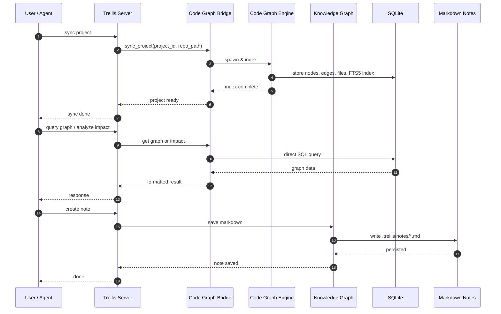

### Indexing Workflow

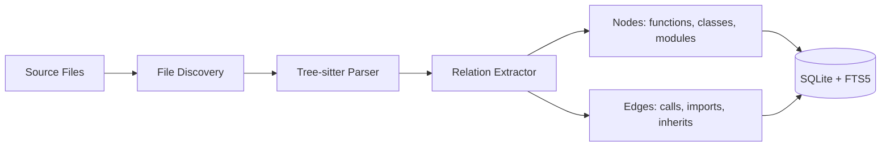

### Query & Analysis Workflow

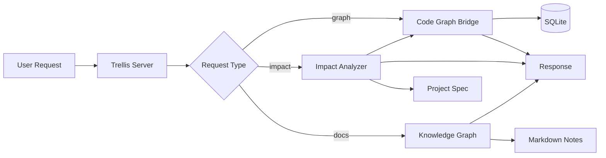

---

## Usage Process

### Step-by-Step User Workflow

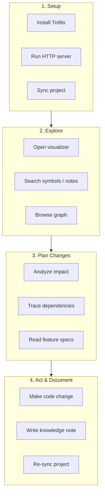

### 1. Install and Start

- Start Trellis in HTTP mode.
- Server runs locally on `http://localhost:17317`.

### 2. Sync a Project

- Point Trellis to a repository.
- The Code Graph Engine parses the codebase and builds the graph database.
- Knowledge notes are stored in the project-local `.trellis/notes/` directory.

### 3. Explore the Graph

- Open the visualizer in the browser.
- Switch between Code Graph and Doc Graph.
- Search for functions, classes, or notes.
- Click nodes to see relationships and references.

### 4. Plan Before Changing

- Before modifying a function, run impact analysis to see downstream callers and affected features.
- Read linked knowledge notes to understand why a function was written a certain way.
- Trace dependencies between features or modules.

### 5. Make Changes and Re-sync

- Edit code in your normal editor or through an AI agent.
- After changes, re-sync the project so the graph stays current.
- Write or update notes to capture decisions and divergence from specs.

---

## User Journey Examples

### Journey 1: New Developer Onboarding

**Situation:** A new engineer joins the team and needs to understand the authentication flow.

**What they do:**

1. Search for `authenticate` to find relevant functions and classes.
2. Inspect the main authentication function to see its signature, file location, and source code.
3. List modules to understand the directory structure around auth.
4. Read the linked knowledge note `[[Authentication Architecture]]` to learn why JWT was chosen and what constraints apply.

**Tools / API calls used:**

| Call / Endpoint | Purpose |
|-----------------|---------|
| `search_code("authenticate")` | Find entry points and related symbols. |
| `get_function("authenticate_user")` | Inspect the function signature and source. |
| `module_overview("src/auth")` | Understand the auth directory layout. |
| `get_note("Authentication Architecture")` | Read the human-written decision doc linked to the code. |

**Outcome:** The developer understands both the code structure and the reasoning behind it, without reading every file.

**Mermaid:**

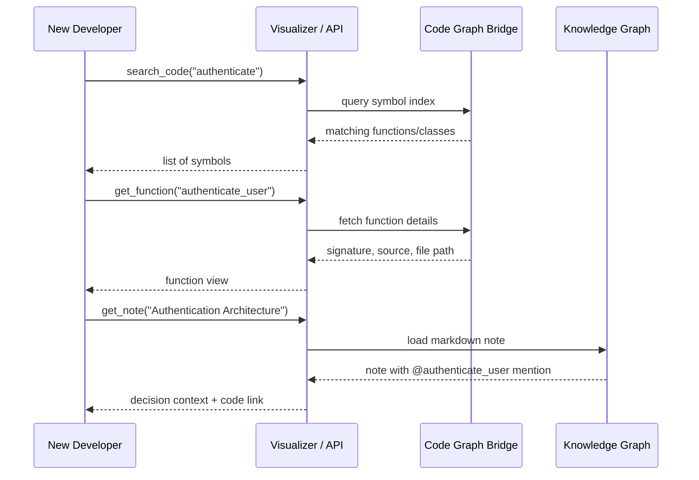

---

### Journey 2: Before Refactoring a Function

**Situation:** A developer wants to rename or change a core function.

**What they do:**

1. Analyze impact of the function to see all callers and affected features.
2. Trace dependencies between the function's module and other modules.
3. Review hotspots to see if the function is a central chokepoint.
4. Read the feature spec to understand constraints.

**Tools / API calls used:**

| Call / Endpoint | Purpose |
|-----------------|---------|
| `analyze_impact("authenticate_user")` | See all callers, callees, and risk level. |
| `trace_path("Authentication", "User Management")` | Understand how the two features interact. |
| `detect_hotspots()` | Find high-centrality functions that are risky to change. |
| `feature_info("Authentication")` | Read the project spec for constraints and dependencies. |

**Outcome:** The developer knows exactly what breaks and can plan the refactor safely.

**Mermaid:**

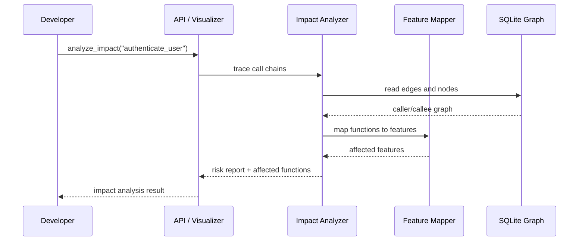

---

### Journey 3: Adding a New Feature

**Situation:** A team needs to add a new shape type to a graphics editor.

**What they do:**

1. Inspect the existing feature spec for Shapes.
2. Find the shape component and UI files using search and module overview.
3. Detect hotspots to avoid overloading already-central files.
4. After implementation, create a knowledge note documenting the new shape and any divergence from the original plan.

**Tools / API calls used:**

| Call / Endpoint | Purpose |
|-----------------|---------|
| `feature_info("Shapes")` | Read the feature spec, decisions, and constraints. |
| `search_code("shape")` | Find shape component and UI files. |
| `module_overview("component/shape")` | Understand the shape implementation layout. |
| `detect_hotspots()` | Identify high-centrality files to be careful with. |
| `create_note("diamond-shape-decision")` | Document why the new shape was added and how it fits the pattern. |

**Outcome:** The feature is implemented following the existing pattern and the decision is preserved for future maintainers.

**Mermaid:**

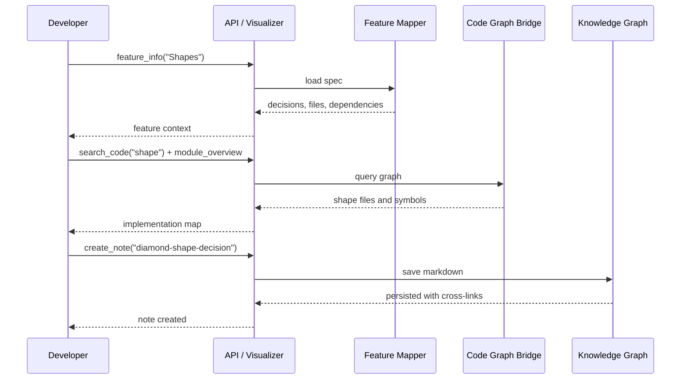

---

### Journey 4: Answering a Dependency Question

**Situation:** A product manager or architect asks: "How does the Icons feature depend on Graphics?"

**What they do:**

1. Trace the path between the Icons feature and the Graphics feature.
2. Search notes for prior documentation about the relationship.
3. Inspect the concrete functions that connect them.

**Tools / API calls used:**

| Call / Endpoint | Purpose |
|-----------------|---------|
| `trace_path("Icons", "Graphics")` | Find direct and indirect code connections between the two features. |
| `search_notes("icon graphics dependency")` | Find prior documentation. |
| `get_function("Icon.render")` / `get_function("Graphics.draw")` | Inspect the concrete functions that form the link. |

**Outcome:** The answer is grounded in actual code connections, not guesswork.

**Mermaid:**

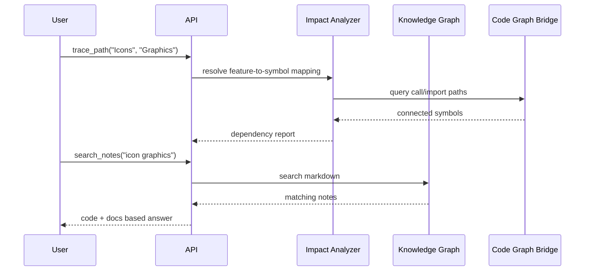

---

## Code, Docs, and Graph Linking

### The Two Graphs

Trellis maintains two complementary graphs:

| Graph | Source | Content | Maintained By |
|-------|--------|---------|---------------|
| **Code Graph** | Source code | Functions, classes, modules, calls, imports | Auto-generated on sync |
| **Doc Graph** | Markdown notes | Feature specs, decisions, knowledge, runbooks | Written by users |

### How They Link

```mermaid
flowchart TB
    subgraph Code["Code Graph"]
        F1["function authenticate_user"]
        F2["function validate_token"]
        C1["class AuthService"]
    end

    subgraph Docs["Doc Graph"]
        N1["Authentication Architecture.md"]
        N2["Security Review.md"]
        N3["OAuth2 Migration.md"]
    end

    N1 -->|@authenticate_user| F1
    N1 -->|@validate_token| F2
    N2 -->|@AuthService| C1
    N3 -->|[[Authentication Architecture]]| N1

    F1 -->|backlink| N1
    F2 -->|backlink| N1
    C1 -->|backlink| N2
```

### Linking Mechanisms

- **Wiki Links** — `[[Note Name]]` creates bidirectional links between markdown notes.
- **Code Mentions** — `@FunctionName` or `@ClassName` links a note to a specific code symbol.
- **Backlinks** — When a note mentions a function, that function's view shows which notes reference it.
- **Feature Specs** — `project.md` maps feature names to file patterns, so the system can connect code symbols to features.

### Data Flow: Code + Docs + Graph

```mermaid
flowchart LR
    CodeFiles["Source Code Files"] -->|parse| Engine["Code Graph Engine"]
    Engine -->|store| CodeGraph[("Code Graph DB")]
    CodeGraph -->|exposes| Symbols["Symbols: functions, classes, modules"]

    UserNotes["User-Written Notes"] -->|parse| KG["Knowledge Graph"]
    KG -->|stores| DocGraph["Doc Graph Files"]
    DocGraph -->|exposes| Notes["Notes: decisions, specs, runbooks"]

    Symbols -->|@mentions| Notes
    Notes -->|[[wiki links]]| Notes
    Symbols -->|backlinks| Notes

    CodeGraph -->|cross-linked| UnifiedGraph["Unified Knowledge Graph"]
    DocGraph -->|cross-linked| UnifiedGraph
```

---

## Purpose of the Graph

The graph is not just a visualization. It is the central data model that makes Trellis useful.

### What the Graph Enables

| Capability | Why It Matters |
|------------|----------------|
| **Impact analysis** | Before changing a function, know exactly what depends on it. |
| **Dependency tracing** | Explain how two features or modules are connected with concrete code paths. |
| **Hotspot detection** | Find functions that are called from many places and are therefore high-risk. |
| **Knowledge preservation** | Link decisions to code so future maintainers know why something exists. |
| **Divergence tracking** | Compare implementation against specs to find drift. |
| **Faster search** | Find symbols by name or concept without grepping across the entire repo. |

### Where the Graph Helps

- **Pre-change planning** — avoid breaking unknown callers.
- **Code reviews** — verify that a PR touches only the intended blast radius.
- **Incident response** — trace how a failure in one module propagates.
- **Onboarding** — newcomers learn the codebase by exploring relationships, not reading files randomly.
- **AI agent assistance** — agents use the graph to answer questions and plan edits with context instead of hallucinating file paths.

### Graph as the Source of Truth

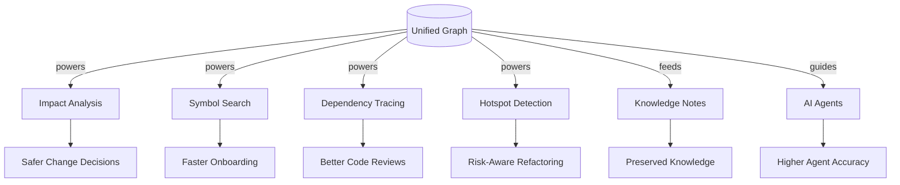

---

## Evaluation Process & Fairness

### What the Eval Measures

The eval is a **manual, proxy-based benchmark** that compares an AI coding agent's performance **with Trellis MCP tools** versus **without Trellis MCP tools**. It focuses on token cost, latency, and call efficiency while the same task is executed twice.

### Core Components

- **Eval Proxy** — A local FastAPI server that sits between the coding agent and the real LLM provider.
- **Web UI** — Dashboard for selecting scenarios, copying prompts, and comparing runs.
- **Golden Dataset** — Predefined tasks with expected changes, blast radius, and acceptance criteria.
- **SQLite Store** — Records every intercepted LLM call and its metrics.

### How the Eval Works

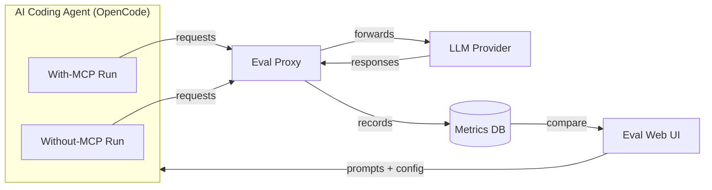

### Step-by-Step Process

1. **Start the proxy** — Runs locally on `http://127.0.0.1:17417`.
2. **Configure the agent** — Point the agent's LLM base URL to the proxy instead of the provider directly.
3. **Select a scenario** — Choose a task from the golden dataset.
4. **Run with MCP** — Copy the With-MCP prompt and run it in the agent. The Trellis MCP skill is available for impact and feature queries.
5. **Run without MCP** — Copy the Without-MCP prompt and run the same task again.
6. **Compare runs** — The UI shows token counts, call counts, and latency for both modes.

### Metrics Tracked

- Prompt tokens
- Completion tokens
- Reasoning tokens (extracted from provider fields or estimated with tiktoken)
- Total tokens
- Number of LLM calls
- Latency per call and total duration
- Scenario ID and mode (`with_mcp` / `without_mcp`)

### Fairness Mechanisms

| Mechanism | Purpose |
|-----------|---------|
| **Same task, same agent** | Both runs use the same codebase, same scenario, and same model. |
| **Same token estimator** | When upstream usage is not returned, both runs use the same tiktoken encoder, so estimates are comparable. |
| **Same provider** | The proxy forwards both runs to the same LLM provider with the same API key. |
| **Reasoning separation** | Reasoning tokens are extracted or estimated consistently for both runs. |
| **No prompting advantage** | The Without-MCP prompt does not mention Trellis; the With-MCP prompt only references the skill, not specific files or project IDs. The agent must still discover the right context. |

### Current Limitations

- **Manual execution** — the agent must be run twice per scenario.
- **No automatic correctness scoring** — the proxy tracks cost and speed; functional correctness is scored separately.
- **Limited agent behavior tracking** — it does not yet automatically track which files the agent read, how long to first relevant file, or blast-radius accuracy. Those are left for manual evaluation or future instrumentation.
- **Baseline tracking is incomplete** — because the codebase was not fully tracked earlier, initial numbers reflect partial visibility and will improve as graph coverage and instrumentation get better.

### Fairness of the Comparison

The comparison is designed to be fair because:

- Both runs start from the same initial state.
- Both use the same agent, model, and provider.
- The only deliberate difference is access to Trellis MCP tools.
- The proxy records everything transparently and uses the same estimation logic for both sides.
- Functional correctness can be scored independently against the golden dataset.

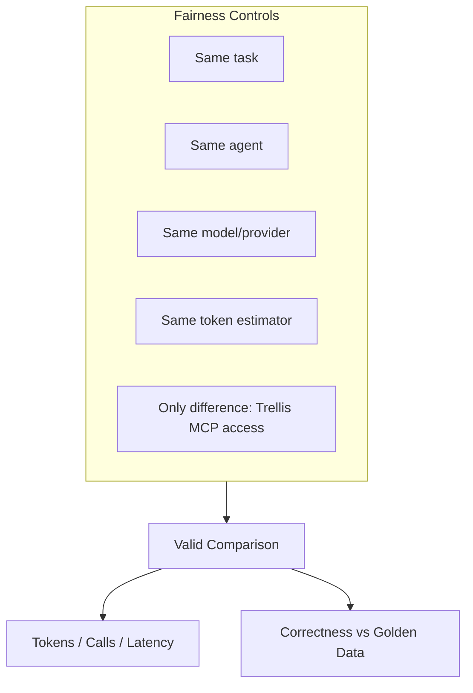

---

## HTTP-Only Deployment

If your organization blocks MCP inside Copilot, you can run Trellis as a local HTTP API and call the REST endpoints directly. The HTTP server exposes all graph, feature, and knowledge operations without requiring stdio MCP.

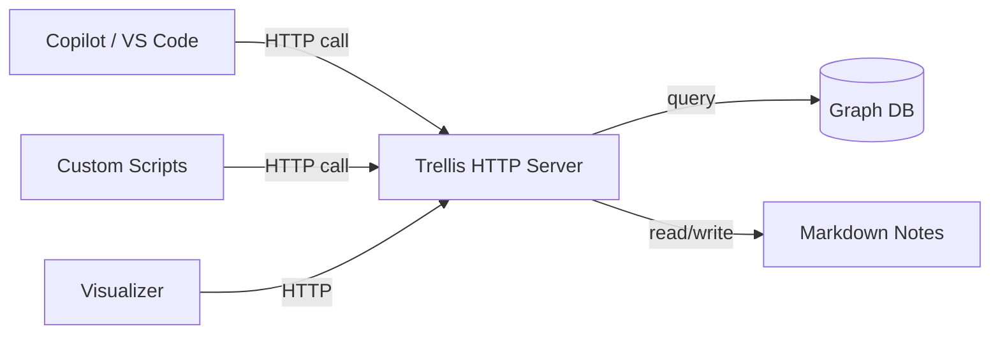

---

## Summary

Trellis is a local, dual-knowledge system that combines auto-generated code graphs with human-written knowledge notes. It helps organizations reduce change risk, preserve decisions, onboard developers, and make AI coding agents more accurate. The graph is the central model that powers search, impact analysis, dependency tracing, and knowledge linking. The evaluation process compares agent performance with and without Trellis tools, using a fair proxy-based design that records cost, latency, and call efficiency.
